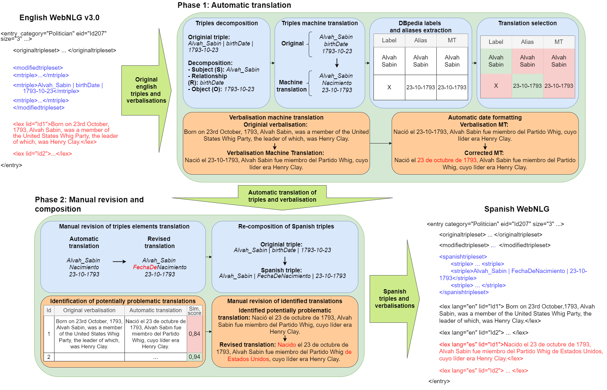

# Exploring LLM-based Triple-to-Text Generation in Spanish: A WebNLG-Based Approach  

## Overview  

This repository contains the resources presented in **Exploring LLM-based Triple-to-Text Generation in Spanish: A WebNLG-Based Approach**. Specifically, we present **Spanish WebNLG dataset** and the corresponding code for **Spanish Data-to-Text Generation** using various low-resource language models. We evaluate models using **context learning** and **fine-tuning**, comparing their performance on structured data representation tasks. The dataset follows the **WebNLG_ES format**, structured into different triples sets for **train**, **dev**, and **test** splits.  

We measure performance using **BLEU, METEOR, CHRF++, Cosine Similarity, and BERTScore**.  

## Repository Structure  

```
Spanish_data-to-text-main
│   LICENSE
│   README.md
│   requirements.txt
│
├── code
│   ├── context_learning_evaluation
│   ├── fine_tuning
│   ├── fine_tuning_evaluation
    ├── metrics_computation
│
├── data
│   ├── WebNLG_ES
│   │   ├── train
│   │   │   ├── 1triples
│   │   │   ├── 2triples
│   │   │   ├── 3triples
│   │   │   ├── 4triples
│   │   │   ├── 5triples
│   │   │   ├── 6triples
│   │   │   ├── 7triples
│   │   ├── dev
│   │   │   ├── 1triples
│   │   │   ├── 2triples
│   │   │   ├── 3triples
│   │   │   ├── 4triples
│   │   │   ├── 5triples
│   │   │   ├── 6triples
│   │   │   ├── 7triples
│   │   ├── test
│
├── models_adapters
│
├── results
│   ├── spanish_triples_to_text_results.xlsx
│   ├── context_learning
│   │   ├── test_1
│   │   ├── test_2
│   ├── fine_tuning
│   │   ├── test_1
│   │   ├── test_2
```

## Spanish WebNLG

Adaptation to Spanish of the English WebNLG dataset[^1] following a two step methodology: automatic translation of triples and verbalisations followed by a partial manual revision.

[^1]: [The 2023 WebNLG Shared Task on Low Resource Languages. Overview and Evaluation Results (WebNLG 2023)](https://aclanthology.org/2023.mmnlg-1.6/) (Cripwell et al., MMNLG 2023)

## Setup  

### Requirements  

Ensure you have the required dependencies installed:  

```bash
pip install -r requirements.txt
```

### Data Preparation  

The dataset is structured into **train**, **dev**, and **test** sets, with different numbers of RDF triples per sample.  

## Model Training & Evaluation  

### Context Learning Evaluation  

Evaluate models using **zero-shot, one-shot, and few-shot** learning:  

```bash
python code/context_learning_evaluation/verb_evaluation_CausalLM_WebNLG_ES_instruct.py
```

### Fine-Tuning  

Fine-tune models on WebNLG_ES using:  

```bash
python code/fine_tuning/fine_tuning_instruct_llama_1B.py
```

### Fine-Tuning Evaluation  

Evaluate fine-tuned models with:  

```bash
python code/fine_tuning_evaluation/verb_evaluation_CausalLM_WebNLG_ES_instruct_fine_tuned.py
```

### Metrics Computation 

Compute the metrics for the evaluations with:  

```bash
python code/metrics_computation/compute_metrics_instruct.py
```

## Evaluation Metrics  

We use the following metrics to assess model performance:  

- **BLEU**  
- **METEOR**  
- **CHRF++**  
- **Cosine Similarity**  
- **BERTScore**  

Results are saved in `results/context_learning/` and `results/fine_tuning/`.  

## License  

This repository is licensed under the **GNU General Public License v3.0 (GPL-3.0)**. See [LICENSE](LICENSE) for details.  

## Citation  

If you use this dataset or code, please cite:  

```
Technical publication on development.
```

---
